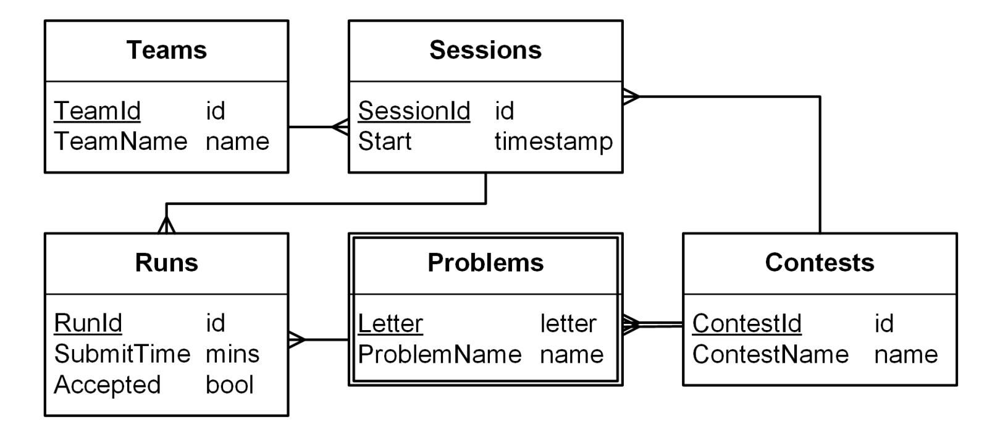

# Контрольная по запросам

## [Содержание](./../README.md)

* [**ДЗ-1. Установка и использование СУБД**](./../HW_1)
* [**ДЗ-2. Моделирование БД «Университет»**](./../HW_2)
* [**ДЗ-3. Функциональные зависимости в БД «Университет»**](./../HW_3)
* [**ДЗ-4. Нормализация БД «Университет»**](./../HW_4)
* [**ДЗ-5. Реляционная алгебра**](./../HW_5)
* [**ДЗ-6. Реляционное исчисление**](./../HW_6)
* [**ДЗ-7. Изменение данных**](./../HW_7)
* [**ДЗ-8. Индексирование**](./../HW_8)
* [**ДЗ-9. Хранимые процедуры**](./../HW_9)
* [**ДЗ-10. Транзакции**](./../HW_10)
* **КР-1. Контрольная по запросам**
* [**Технические особенности проверки**](./../Technical_specifics.md)

---

## Задание

#### Схема базы данных «Соревнования по программированию».

###### Примечание

В таблице Runs:

* _SubmitTime_ – целое число минут, прошедших с начала соревнования;
* _Accepted_ – 1, если зачтено, иначе 0.

#### Реализуйте запросы к базе данных «Соревнования по программированию»

1. Запишите следующие запросы в терминах реляционной алгебры и на языке SQL
    1. Идентификаторы команд, участвующих в соревновании (*TeamId* по *:ContestId*).
    2. Названия команд, участвующих в соревновании (*TeamName* по *:ContestId*).
    3. Неудачные подходы в соревновании (*RunId*, *SessionId*, *Letter*, *SubmitTime* по *:ContestId*).
    4. Команды, не пославшие ни одной задачи в соревновании (*TeamName* по *:ContestId*).
    5. Команды, не сделавшие ни одного подхода хотя бы в одном соревновании (*TeamName*).
    6. Команды не сделавшие ни одного подхода хотя бы в одном соревновании, в котором они участвовали (*TeamName*).
    7. Сессии, сделавшие подходы по всем задачам в соревновании (*SessionId*).
    8. Сессии, в которых решены все задачи соревнования (*SessionId*).
    9. Команды, сделавшие неудачные подходы по всем задачам хотя бы в одном соревновании (*TeamName*).
    10. Задачи в которых ошиблись все команды, участвовавшие в соревновании (_ContestId_, *Letter*).
2. Запишите следующие запросы на языках Datalog и SQL
    1. Идентификаторы команд, ошибшихся в задаче (*TeamId* по *:ContestId*, *:Letter*).
    2. Названия команд, не решивших задачу (*TeamName* по *:ContestId*, *:Letter*).
    3. Команды, ошибившиеся хотя бы одной задачи в соревнования (*TeamId* по *:ContestId*).
    4. Задачи, решённые всеми сессиями, участвовашими в соревновании (*ContestId*, *Letter*).
    5. Команды, решившие все задачи, не решённые заданной командой (*TeamId* по :TeamId).
    6. Задачи которые не решила ни одна команда, участвовавшая в соревновании (_ProblemName_).
3. Запишите изменяющие запросы на языке SQL
    1. Удалить все подходы команды (*TeamId*).
    2. Удалить все подходы соревнования (_ContestName_).
    3. Для каждой команды, участвовавшей в соревновании добавить новую сессию с текущим временем начала (
       _current_timestamp_) (*ContestId*).
    4. Сделать последний ошибочный подход в каждой сессии успешным.
    5. Сделать первый подход по каждой задаче в каждой сессии ошибочным.
    6. Для каждой сессии, пытавшейся, но не решившей задачу добавить успешный подход через минуту после последнего
       подхода по этой задаче. (*ContestId*).
    7. Для каждой сессии сделать успешный подход по задаче с нулевым временем. Если задача уже была решена, то изменить
       время успешного подхода. [Не проверяется на SQLite.] (*ContestId*, *Letter*).
4. Запишите агрегирующие запросы на языке SQL
    1. Для каждой сессии число задач, по которым были подходы (*SessionId*, *Opened*).
    2. Для каждой команды число задач, по которым были подходы (*TeamId*, *Opened*).
    3. Задачи соревнования, которые решило минимальное число сессий (*Letter* по *:ContestId*).
    4. Для каждого соревнования, задачи, которые решило максимальное число сессий (*ContestId*, *Letter*).
    5. Месяцы, в которые создано максимальное число сессий, решивших хотя бы одну задачу, в формате
       mm-yyyy. [Не проверяется на SQLite.] (_MonthStr_).
    6. Для каждого соревнования найти команду, совершившую последний удачный подход (*ContestId*, *TeamName*,
       *SubmitTime*).
    7. Посчитать число задач, решённых командами. Команды должны быть упорядочены по числу решешенных задач; при
       равенстве результатов — по убыванию времени начала. (*TeamName*, *Solved* по *:ContestId*).
    8. Посчитать штрафное время, полученное командами. Команды должны быть упорядочены по штрафному времени; при
       равенстве результатов — по убыванию времени начала. (*TeamName*, *Solved*, *Penalty* по *:ContestId*).
    9. Построить по соревнованию колонки «решено задач» и «штрафное время» Порядок команд должен быть правильным; при
       равенстве результатов — по убыванию времени начала (*TeamName*, *Solved*, *Penalty* по *:ContestId*).

###### Совет (Для следующих курсов)

Отправляйте "пустые" sql в сложные задачи (которые вы не решили), они дадут eps > 0 доп баллов. 
